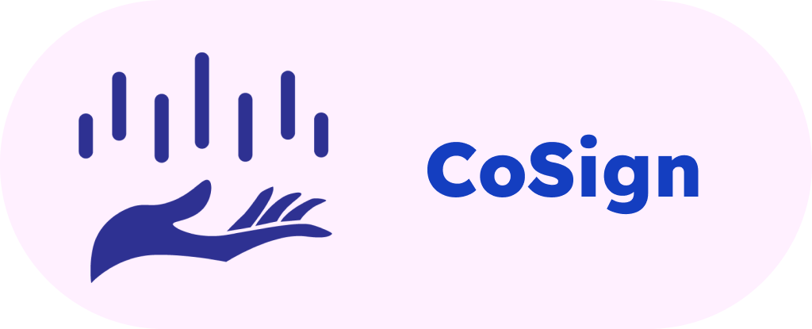

<!-- PROJECT LOGO -->
 

  

<h3 align="center">PSign</h3>

  

    Ứng dụng học và dịch ngôn ngữ ký hiệu ASL. 
     
    <a href="https://github.com/diep312/pSignLanguage"><strong>Khám phá dự án »</strong></a>
     
     
    <a href="https://github.com/diep312/pSignLanguage">Yêu cầu Demo</a>
    ·
    <a href="https://github.com/diep312/pSignLanguage">Báo lỗi (Chưa hỗ trợ)</a>
    ·
    <a href="https://github.com/diep312/pSignLanguage">Góp ý</a>
  

<!-- Mục lục -->

  
Mục lục

  <ol>
    <li>
      <a href="#about-the-project">Giới thiệu dự án</a>
      <ul>
        <li><a href="#built-with">Software stack</a></li>
      </ul>
    </li>
    <li>
      <a href="#getting-started">Hướng dẫn cài đặt</a>
      <ul>
        <li><a href="#prerequisites">Yêu cầu hệ thống</a></li>
        <li><a href="#installation">Cài đặt</a></li>
      </ul>
    </li>
    <li><a href="#contributing">Thành viên đóng góp</a></li>
  </ol>

<!-- ABOUT THE PROJECT -->
## Giới thiệu dự án

![Product Name Screen Shot][product-screenshot]

Theo như điều tra quốc gia người khuyết tật Việt Nam năm 2016, Việt Nam có khoảng 6.3 triệu người câm và điếc, trong đó 2 triệu là người cả câm cả điếc. 
Một số lượng lớn người này sinh sống ở những khu vực hẻo lánh và không có điều kiện được tiếp cận những dịch vụ giáo dục và khám bệnh. Dự án này sẽ hướng tới việc
đưa ra một giải pháp giúp cho những người khuyết tật và những người thân của người khuyết tật giao tiếp với nhau 

Những tính năng chính:
* Sử dụng công nghệ AI và Computer Vision.
* Dịch ngôn ngữ ký hiệu ASL thành ngôn ngữ thường và ngược lại.
* Cung cấp từ điển ngôn ngữ ký hiệu ASL.
* Khóa học dạy ngôn ngữ ASL.

(<a href="#readme-top">Lên đầu trang</a>)

### Software Stack
Những công nghệ phần mềm được sử dụng để xây dựng dự án 

<ul>
    <li>
        <a href="https://www.android.com/">Android</a>
    </li>
    <li>
        <a href="https://kotlinlang.org/">Kotlin</a>
    </li>
    <li>
        <a href="https://square.github.io/retrofit/">Retrofit</a>
    </li>
</ul>

(<a href="#readme-top">Lên đầu trang</a>)

<!-- GETTING STARTED -->
## Hướng dẫn cài đặt
(Sẽ cập nhật link tải file APK tại đây...)

(<a href="#readme-top">back to top</a>)

<!-- CONTRIBUTING -->
## Thành viên
Cảm ơn những thành viên sau vì những công sức đóng góp tới dự án này: 

(<a href="#readme-top">back to top</a>)

<!-- MARKDOWN LINKS & IMAGES -->
[product-screenshot]: preview_images/preview.png
